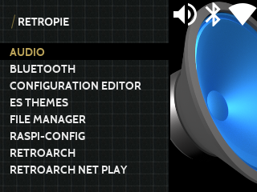
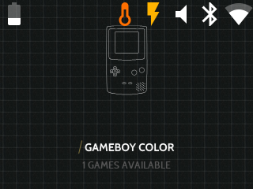
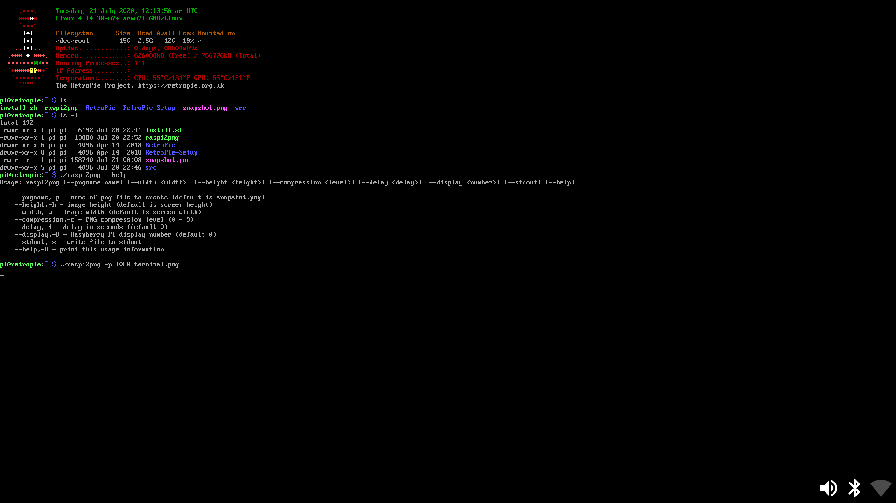
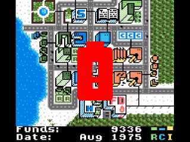

# RetroPie Status Overlay
Based on [gbz_overlay](https://github.com/d-rez/gbz_overlay) script by [d-rez](https://github.com/d-rez)

This repository contains a script to display lovely slightly-transparent overlays on top of your RetroPie games and emulationstation menus

## Features
- display battery level (Requires appropiate Hardware)
- display WiFi state (connected/disconnected/disabled)
- display Bluetooth state (connected/disconnected/disabled)
- display under-voltage state
- display warning if frequency-capped
- display warning if throttling
- gracefully shut down the Pi after 60s from when voltage goes below 3.2V of low voltage detected (abort shutdown when power is restored)
- show a big imminent shutdown warning when the counter starts ticking
- Only critical icons displayed in game
- Shutdown from button press

## More Screenshots

  
*Overlay on TFT theme at 240p*

  
*Overlay on Carbon theme at 1080p*

  
*Overlay on terminal*

  
*Battery Critical icon*

# Automatic Install Instructions

SSH into your device, or access the terminal using F4.

    wget https://raw.githubusercontent.com/bverc/retropie_status_overlay/master/install.sh
    chmod +x install.sh
    ./install.sh

Remove install script once complete

    rm install.sh

# Manual Install Instructions

SSH into your device, or access the terminal using F4.

## Install pngview by AndrewFromMelbourne
    mkdir ~/src
    cd ~/src
    git clone https://github.com/AndrewFromMelbourne/raspidmx
    cd raspidmx/lib
    make
    cd ../pngview
    make
    sudo cp pngview /usr/local/bin/
	
## Run RetroPie Status Overlay
Install psutil module:

    sudo apt-get install python3-psutil
Download the code:

    cd ~/src
    git clone https://github.com/bverc/retropie_status_overlay
    cp retropie_status_overlay/config.ini.example retropie_status_overlay/config.ini
Test the code:

    python3 retropie_status_overlay/overlay.py
You should see the overlay added to your interface

Now to get it to  run at boot:

    sudo crontab -e
    
At the bottom of the file, add the line:

    @reboot python3 /home/pi/src/retropie_status_overlay/overlay.py

reboot

