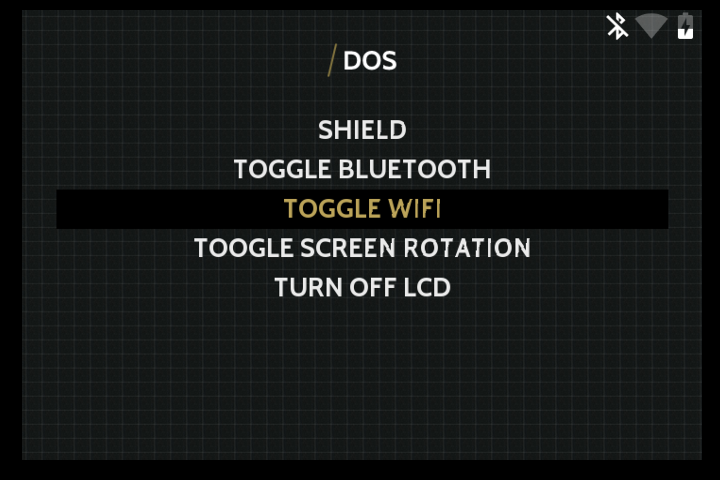
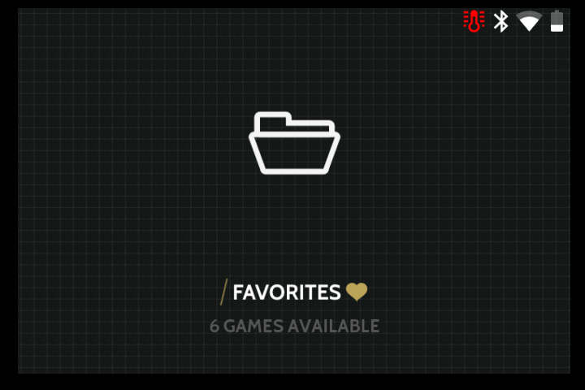
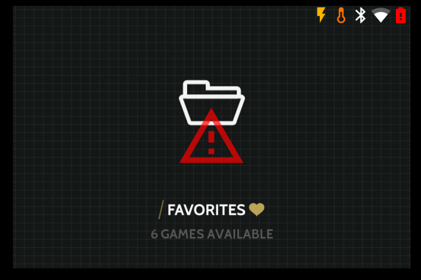
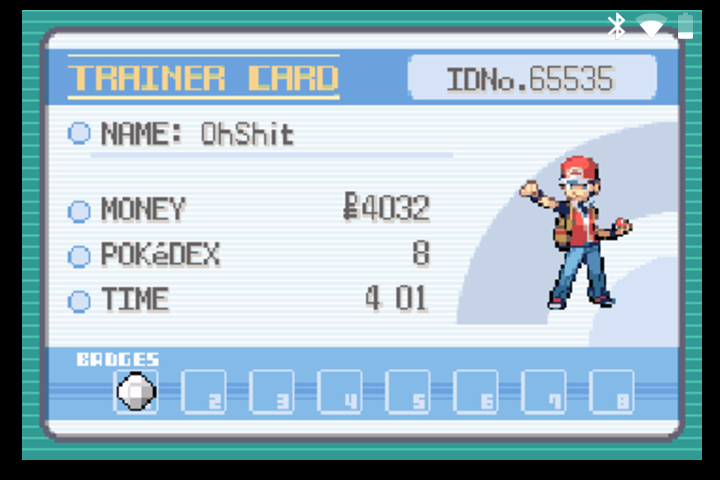

# RetroPie Status Overlay
Based on [gbz_overlay](https://github.com/d-rez/gbz_overlay) script by [d-rez](https://github.com/d-rez)

This repository contains a script to display lovely slightly-transparent overlays on top of your RetroPie games and emulationstation menus

## What can it do?
- adjust to the current resolution
- gracefully shut down the Pi after 60s from when voltage goes below 3.2V
- show a big imminent shutdown warning when the counter starts ticking
- display battery level (charging, discharging, %, critical)
- display WiFi state (connected/disconnected/disabled)
- display Bluetooth state (connected/disconnected/disabled)
- display under-voltage state
- display warning if frequency-capped
- display warning if throttling

## But what does it look like?
Like that:

  
Bluetooth, wifi connected, battery discharging

  
Bluetooth, wifi disconnected, battery discharging

  
Bluetooth, wifi disabled, battery charging

  
CPU throttled due to high temperature

  
Under-Voltage, Freq-capped due to high temperature, battery critical, shutdown imminent warning - shutting down in 60s

  
In-game

# Manual Install Instructions

SSH into your device, or access the terminal using F4.

## Install pngview by AndrewFromMelbourne
    mkdir ~/src
    cd ~/src
    git clone https://github.com/AndrewFromMelbourne/raspidmx.git
    cd raspidmx
    sudo make
    sudo cp lib/libraspidmx.so.1 /usr/lib/
    sudo cp pngview/pngview /usr/local/bin/

## Download Material Design Icons by Google
    cd ~/src
    git clone http://github.com/google/material-design-icons/ material-design-icons-master
	
## Run GBZ Overlay
Download the code:

    cd ~/src
    git clone http://github.com/bverc/retropie_status_overlay
Test the code:

    python3 retropie_status_overlay/overlay.py
You should see the overlay added to your interface

Now to get it to  run at boot:

    sudo crontab -e
    
At the bottom of the file, add the line:

    @reboot python3 /home/pi/src/retropie_status_overlay/overlay.py

reboot

